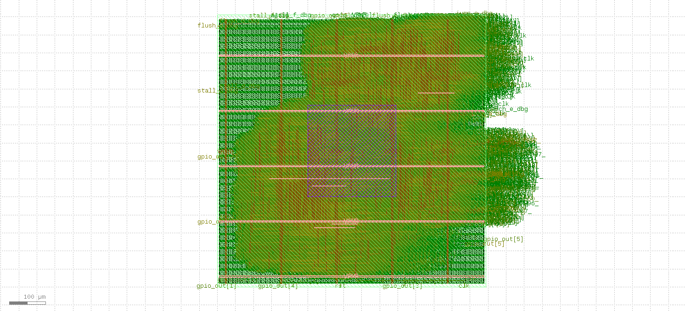

# 32-bit Pipelined RISC-V Processor

This project implements a 32-bit pipelined RISC-V processor / minimal SoC-style design in VHDL. The current design includes a 5-stage pipeline, hazard handling, forwarding, valid-bit based pipeline control, reset synchronization, and a dynamic branch prediction unit using a 2-bit Branch History Table (BHT), Branch Target Buffer (BTB), BTB valid bits, BTB tags, and misprediction recovery. The design also includes a simple memory-mapped BUS/address decoder and an 8-bit GPIO output peripheral. The RTL was converted to Verilog using GHDL, checked with Yosys, and successfully taken through the OpenLane/SKY130 RTL-to-GDSII flow.

---

## Repository Organization

Recommended repository structure:

```text
rtl/       - Synthesizable VHDL RTL files
tb/        - Testbench files
docs/      - Architecture notes, memory map, screenshots
programs/  - Hardcoded instruction memory test programs
waves/     - Waveform PDFs/screenshots
reports/   - Simulation and OpenLane reports
openlane/  - OpenLane design configuration and generated implementation files
```

Important generated/checkpoint files:

```text
rtl/top_synth.v                         - Verilog generated from VHDL using GHDL
rtl/yosys_check.log                     - Yosys check log
reports/openlane/metrics.csv            - OpenLane metrics
reports/openlane/manufacturability.rpt  - OpenLane manufacturability report
reports/openlane/31-rcx_sta.checks.rpt  - STA checks / fanout warnings
```

---

## Pipeline Overview

The processor follows a standard 5-stage pipeline:

1. **IF** - Instruction Fetch
2. **ID** - Instruction Decode / Register Read
3. **EX** - Execute / Branch Resolution
4. **MEM** - Data Memory Access
5. **WB** - Write Back

Pipeline registers used:

- `IF/ID`
- `ID/EX`
- `EX/MEM`
- `MEM/WB`

Valid bits are passed through the pipeline to prevent bubbles, flushed instructions, or invalid instructions from updating architectural state.

---

## Currently Tested Instruction Support

The current test program verifies:

- `ADDI`
- `ADD`
- `SUB`
- `LW`
- `SW`
- `BEQ`
- `JAL`
- ALU forwarding
- Load-use stall handling
- Branch flush handling
- Jump flush handling
- 2-bit branch predictor learning
- BTB target prediction
- BTB tag-based alias prevention
- BUS/address decoder
- Memory-mapped 8-bit GPIO output
- GHDL VHDL-to-Verilog conversion
- Yosys synthesis/check flow
- OpenLane/SKY130 RTL-to-GDSII implementation

---

## Major Implementation Steps

### 1. Basic Pipelined Processor

The first version implemented the basic datapath:

- Program counter
- Instruction memory
- Register file
- ALU
- Data memory
- Sign extension
- Control unit
- Pipeline registers

At this stage, branches and jumps were resolved in the EX stage. When a branch or jump was taken, younger instructions were flushed.

---

### 2. Hazard Unit and Forwarding

A hazard unit was added to handle pipeline hazards.

The hazard unit generates:

- `stall_f`
- `stall_d`
- `flush_d`
- `flush_e`
- `forward_ae`
- `forward_be`

Forwarding paths were added from later pipeline stages back to the EX stage ALU inputs.

This allows dependent ALU instructions to execute without unnecessary stalls.

---

### 3. Load-Use Stall Handling

Load-use hazard detection was added.

When an instruction depends on a value being loaded from memory, the processor stalls fetch/decode and inserts a bubble into execute.

This prevents the dependent instruction from using invalid data before the load result is available.

---

### 4. Valid Bit Support

Valid bits were added to the pipeline:

- `valid_f`
- `valid_d`
- `valid_e`
- `valid_m`
- `valid_w`

The purpose of valid bits is to distinguish real instructions from bubbles and flushed instructions.

Final write enables are gated using valid bits:

```vhdl
reg_write_real <= valid_w and reg_write_w;
mem_write_real <= valid_m and mem_write_m;
```

The branch predictor update is also gated:

```vhdl
predictor_update_e <= valid_e and branch_e;
```

This prevents invalid or flushed instructions from modifying architectural or predictor state.

---

### 5. Reset Synchronizer

A reset synchronizer was added at top level.

The external reset can assert immediately, but reset deassertion is synchronized to the clock.

```vhdl
process(clk, rst)
begin
  if rst = '1' then
    rst_sync1 <= '1';
    rst_sync2 <= '1';
  elsif rising_edge(clk) then
    rst_sync1 <= '0';
    rst_sync2 <= rst_sync1;
  end if;
end process;

rst_local <= rst_sync2;
```

Internal pipeline registers use `rst_local`.

---

## Branch Predictor Implementation

The branch predictor was implemented incrementally.

---

### Step 1: Direction-Only 2-bit BHT

The first branch predictor version used only a 2-bit Branch History Table.

```vhdl
type bht_type is array(0 to 15) of std_logic_vector(1 downto 0);
signal bht : bht_type := (others => "01");
```

A 16-entry BHT was used. The index is taken from the fetch PC:

```vhdl
index_f <= to_integer(unsigned(pc_f(5 downto 2)));
```

`pc(1 downto 0)` is ignored because RV32 instructions are word-aligned, so those bits are normally `00`.

For a 16-entry table, four useful PC bits are needed:

```vhdl
pc(5 downto 2)
```

Each BHT entry stores a 2-bit saturating counter:

| Counter | Meaning | Prediction |
|---|---|---|
| `00` | Strongly not taken | Not taken |
| `01` | Weakly not taken | Not taken |
| `10` | Weakly taken | Taken |
| `11` | Strongly taken | Taken |

The MSB is used as the prediction:

```vhdl
predict_taken_f <= bht(index_f)(1);
```

The full 2-bit value is needed because it provides confidence. One unusual branch result does not immediately flip the prediction direction.

---

### Step 2: BHT Update in Execute Stage

Prediction happens in IF, but the real branch result is known in EX.

Therefore two PCs are used:

- `pc_f` for prediction
- `pc_e` for update

```vhdl
index_f <= to_integer(unsigned(pc_f(5 downto 2)));
index_e <= to_integer(unsigned(pc_e(5 downto 2)));
```

The actual branch result is generated in EX:

```vhdl
actual_taken_e <= branch_e and zero_e;
predictor_update_e <= valid_e and branch_e;
```

If the branch is taken, the counter increments toward `11`.

If the branch is not taken, the counter decrements toward `00`.

---

### Step 3: Adding the BTB

The BHT only predicts direction. It does not provide the target address.

To fetch from the predicted target, a Branch Target Buffer was added.

```vhdl
type btb_type is array(0 to 15) of std_logic_vector(31 downto 0);
signal btb : btb_type := (others => (others => '0'));
```

The BTB stores the target PC of previously taken branches.

When a branch is taken in EX:

```vhdl
btb(index_e) <= actual_target_e;
btb_valid(index_e) <= '1';
```

Then the predictor can output:

```vhdl
predicted_target_f <= btb(index_f);
```

---

### Step 4: Adding BTB Valid Bits

After reset, the BTB contains zeros. A predicted target should not be used unless the entry has been written before.

Therefore valid bits were added:

```vhdl
signal btb_valid : std_logic_vector(15 downto 0) := (others => '0');
```

Prediction was gated with the valid bit:

```vhdl
predict_taken_f <= bht(index_f)(1) and btb_valid(index_f);
```

This prevents the processor from jumping to an invalid target after reset.

---

### Step 5: Pipelining Prediction Information

The branch is predicted in IF but resolved in EX.

So the prediction information must travel with the instruction through the pipeline.

Signals added:

```vhdl
predicted_taken_d  : std_logic;
predicted_taken_e  : std_logic;

predicted_target_d : std_logic_vector(31 downto 0);
predicted_target_e : std_logic_vector(31 downto 0);
```

These are passed through:

```text
IF → ID → EX
```

This allows the EX stage to compare what was predicted against what actually happened.

---

### Step 6: Misprediction Detection

A branch misprediction is detected in EX.

Direction mismatch:

```vhdl
taken_mismatch_e <= predicted_taken_e xor actual_taken_e;
```

Target mismatch:

```vhdl
target_mismatch_e <= '1' when
    valid_e = '1' and branch_e = '1' and
    predicted_taken_e = '1' and actual_taken_e = '1' and
    predicted_target_e /= pc_target_e
else '0';
```

Final mispredict signal:

```vhdl
mispredict_e <= branch_prediction_enable and valid_e and branch_e and
                (taken_mismatch_e or target_mismatch_e);
```

Correct recovery PC:

```vhdl
correct_pc_e <= pc_target_e when actual_taken_e = '1' else pc_plus_4_e;
```

---

### Step 7: Predictor-Controlled PC Selection

The old design used a simple two-input PC mux:

```text
PC + 4
or
branch target from EX
```

After branch prediction, the PC selection needs more choices.

Final PC priority:

1. Misprediction recovery
2. Unpredicted jump correction
3. Predicted taken branch target
4. Normal `PC + 4`

```vhdl
process(branch_prediction_enable, mispredict_e, correct_pc_e,
        valid_e, jump_e, branch_e, zero_e,
        pc_target_e, predict_taken_f, predicted_target_f, pc_plus_4)
begin
  if branch_prediction_enable = '1' then

    if mispredict_e = '1' then
      pc_next <= correct_pc_e;

    elsif valid_e = '1' and jump_e = '1' then
      pc_next <= pc_target_e;

    elsif predict_taken_f = '1' then
      pc_next <= predicted_target_f;

    else
      pc_next <= pc_plus_4;
    end if;

  else

    if valid_e = '1' and (((branch_e = '1') and (zero_e = '1')) or jump_e = '1') then
      pc_next <= pc_target_e;

    else
      pc_next <= pc_plus_4;
    end if;

  end if;
end process;
```

---

### Step 8: BTB Aliasing Problem

After prediction was connected to the PC, a new issue appeared.

The processor correctly predicted the repeated branch, but after the program ended and the PC continued into NOP memory, it sometimes jumped back to an old BTB target.

Reason:

The BTB originally used only low PC bits as the index:

```vhdl
pc(5 downto 2)
```

With only 16 entries, different PCs can map to the same BTB entry.

Example:

```text
PC 16  → index 4
PC 80  → index 4
PC 144 → index 4
```

If PC 16 stores a BTB target of 8, then PC 80 may incorrectly read that same entry and jump to 8.

This is called **aliasing**.

---

### Step 9: Solving Aliasing with BTB Tags

To fix aliasing, BTB tags were added.

A tag stores the PC that originally created the BTB entry.

```vhdl
type tag_type is array(0 to 15) of std_logic_vector(31 downto 0);
signal btb_tag : tag_type := (others => (others => '0'));
signal btb_hit_f : std_logic;
```

When updating the BTB:

```vhdl
btb(index_e)       <= actual_target_e;
btb_tag(index_e)   <= pc_e;
btb_valid(index_e) <= '1';
```

During prediction:

```vhdl
btb_hit_f <= '1' when btb_valid(index_f) = '1' and btb_tag(index_f) = pc_f else '0';

predict_taken_f    <= bht(index_f)(1) and btb_hit_f;
predicted_target_f <= btb(index_f);
btb_valid_f        <= btb_hit_f;
```

Now the processor only uses a BTB entry when the stored tag matches the current fetch PC.

This prevents unrelated PCs with the same index from incorrectly using an old target.

---

## Branch Predictor ON/OFF Comparison

A control signal was added:

```vhdl
signal branch_prediction_enable : std_logic := '1';
```

This allows testing the exact same program with prediction enabled or disabled.

---

## Simulation Comparison

The same instruction memory program was simulated twice:

1. **Branch prediction disabled**
2. **Branch prediction enabled**

The goal was to confirm that the branch predictor reduces unnecessary flushes and increases useful retired instructions within the same fixed simulation window.

### Test Configuration

- Simulation window: 60 cycles
- Same instruction memory contents
- Same pipeline, hazard unit, forwarding paths, and valid-bit logic
- Only `branch_prediction_enable` was changed

```vhdl
signal branch_prediction_enable : std_logic := '0'; -- predictor OFF
```

```vhdl
signal branch_prediction_enable : std_logic := '1'; -- predictor ON
```

---

### ModelSim Report: Predictor OFF

```text
========================================
Simulation Complete!
Cycle count          = 60
Instructions retired = 38
Stall count          = 2
Flush count          = 9
Branch count         = 11
Jump count           = 1
========================================
```

### ModelSim Report: Predictor ON

```text
========================================
Simulation Complete!
Cycle count          = 60
Instructions retired = 44
Stall count          = 2
Flush count          = 6
Branch count         = 11
Jump count           = 1
========================================
```

---

### Comparison Table

| Metric | Predictor OFF | Predictor ON | Improvement |
|---|---:|---:|---:|
| Cycle count | 60 | 60 | Same fixed simulation window |
| Instructions retired | 38 | 44 | +6 instructions |
| Stall count | 2 | 2 | Same |
| Flush count | 9 | 6 | 3 fewer flushes |
| Branch count | 11 | 11 | Same program behavior |
| Jump count | 1 | 1 | Same program behavior |
| Approx. IPC | 0.633 | 0.733 | +15.8% |

---

### Interpretation

With branch prediction disabled, taken branches are resolved in the EX stage. This causes younger instructions to be flushed whenever the branch or jump redirects the PC.

With branch prediction enabled, repeated taken branches are learned by the 2-bit BHT and redirected earlier using the BTB target. Therefore, some branch redirects no longer require a full flush.

Flush count decreased:

```text
9 → 6
```

This is 3 fewer flushes, or approximately:

```text
33.3% fewer flushes
```

Instructions retired in the same 60-cycle simulation window increased:

```text
38 → 44
```

Approximate IPC:

```text
Predictor OFF = 38 / 60 = 0.633
Predictor ON  = 44 / 60 = 0.733
```

Approximate IPC improvement:

```text
(0.733 - 0.633) / 0.633 ≈ 15.8%
```

---

## Final Branch Predictor Features

The implemented branch predictor includes:

- 16-entry 2-bit Branch History Table
- 2-bit saturating counters
- Branch Target Buffer
- BTB valid bits
- BTB tags
- Prediction information pipelined to EX
- Misprediction detection
- Correct PC recovery
- Predictor enable/disable comparison mode

---
## BUS and Memory-Mapped GPIO

After the CPU core and branch predictor were verified, a simple memory-mapped BUS/address decoder was added. This makes the design closer to a minimal SoC-style chip instead of only a standalone CPU core.

The BUS sits between the CPU memory stage and memory-mapped targets:

```text
CPU MEM stage
  addr       = alu_res_m
  write_data = write_data_m
  mem_we     = mem_write_real
       |
       v
BUS / address decoder
       |
       |-- data memory
       |
       |-- GPIO output register
```

The register file, ALU, branch predictor, and pipeline registers are not connected to the BUS. They remain internal CPU datapath blocks. The BUS is used only for memory-stage accesses.

---

### Memory Map

| Address Range / Address | Target |
|---|---|
| `0x00000000` onward | Data memory |
| `0x00000040` | 8-bit GPIO output register |

The GPIO output register is accessed using normal RISC-V store instructions.

Example:

```asm
addi x1, x0, 8
sw   x1, 64(x0)     -- writes 00001000 to gpio_out
```

This drives only GPIO pin 3 high because pin number is represented by bit position:

```text
pin 0 = 00000001 = 1
pin 1 = 00000010 = 2
pin 2 = 00000100 = 4
pin 3 = 00001000 = 8
```

---

### Address Decoder

The BUS decodes the CPU memory-stage address.

When the CPU stores to `0x00000040`, the write is routed to GPIO:

```vhdl
gpio_sel <= '1' when addr = x"00000040" else '0';

gpio_we <= mem_we and gpio_sel;
dmem_we <= mem_we and not gpio_sel;
```

This is important because a GPIO write should not also write into normal data memory. Without `dmem_we`, a store to `0x00000040` could update both the GPIO register and data memory. With the BUS, the store goes to only one target.

---

### GPIO Output Register

The current GPIO peripheral is output-only:

```vhdl
gpio_out : out std_logic_vector(7 downto 0)
```

A store to `0x00000040` updates the lower 8 bits of the GPIO register:

```vhdl
if rising_edge(clk) then
  if rst = '1' then
    gpio_reg <= (others => '0');
  elsif gpio_we = '1' then
    gpio_reg <= write_data(7 downto 0);
  end if;
end if;

gpio_out <= gpio_reg;
```

This is synthesizable logic and infers an 8-bit register plus address decode logic.

---

### GPIO Simulation Result

A GPIO test program writes the pattern:

```text
1 -> 2 -> 4 -> 8 -> repeat
```

Expected waveform:

```text
gpio_out = 00000000 -> 00000001 -> 00000010 -> 00000100 -> 00001000 -> repeat
```

The simulation confirmed that stores to address `0x00000040` correctly update `gpio_out`, while `dmem_we` remains low during GPIO writes. This verifies that the BUS correctly routes writes either to data memory or GPIO.

---


## VHDL to Verilog / Yosys Check

The source RTL is written in VHDL. Since OpenLane primarily expects Verilog input, GHDL was used to generate Verilog from the VHDL RTL.

Command used:

```bash
ghdl --synth --std=08 --out=verilog top > top_synth.v
```

The generated Verilog was then checked using Yosys:

```bash
yosys -p "read_verilog top_synth.v; hierarchy -top top; proc; check" | tee yosys_check.log
```

Yosys reported:

```text
Found and reported 0 problems.
```

This confirmed that the generated Verilog could be read and processed before starting the OpenLane physical design flow.

---

## OpenLane / SKY130 RTL-to-GDSII Result

The design was implemented using OpenLane with the SKY130 open-source PDK.

Flow completed:

```text
VHDL RTL
-> GHDL Verilog generation
-> Yosys/OpenLane synthesis
-> Floorplanning
-> Placement
-> Clock Tree Synthesis
-> Routing
-> Signoff checks
-> GDSII generation
```

OpenLane completed successfully:

```text
[SUCCESS]: Flow complete.
```

### Implementation Metrics

| Metric | Value |
|---|---:|
| Flow status | Completed |
| Total runtime | 35 min 2 sec |
| Routed runtime | 28 min 30 sec |
| Die area | 0.5625 mm² |
| OpenDP utilization | 35.88% |

### Timing / Signoff Summary

| Check | Result |
|---|---|
| Setup timing | No setup violations |
| Hold timing | No hold violations |
| Max slew | No violations |
| Max capacitance | No violations |
| GDSII generation | Completed |

Remaining warnings from the first run:

- Max fanout violations on clock-tree leaf buffers
- 4 unconstrained endpoints
- IR drop warning because `VSRC_LOC_FILES` was not defined

The max fanout warnings were mainly on clock tree leaf buffers, for example:

```text
clkbuf_leaf_.../X   limit 10   actual 11   (VIOLATED)
```

This is documented as a first-pass optimization issue, not a functional RTL bug. Future OpenLane cleanup can tune CTS/buffering settings to reduce these violations.

### GDS Layout Screenshot

If the screenshot is available in the repository, it can be viewed here:

```markdown

```

---

## Known Current Limitations

This is still a learning/project CPU and has some limitations:

1. **Small BHT/BTB size**
   - Only 16 entries are used.
   - Larger programs may still cause conflict pressure.

2. **Simple index**
   - The index uses `pc(5 downto 2)`.
   - Larger predictors often use more entries or hashed/global-history indexing.

3. **BEQ-focused branch behavior**
   - Current branch result is based on:
     ```vhdl
     actual_taken_e <= branch_e and zero_e;
     ```
   - More branch types require expanded branch compare logic.

4. **JAL is not predicted**
   - Jumps are still corrected in EX:
     ```vhdl
     valid_e and jump_e
     ```
   - A future version could also predict jumps using the BTB.

5. **No global history yet**
   - This is a local 2-bit predictor.
   - GShare/global history prediction can be added later.

6. **Small instruction/data memory**
   - Current programs are manually loaded into instruction memory.
   - Running compiled programs would require a proper machine-code loading flow.

7. **GPIO is currently output-only**
   - Current GPIO supports only an 8-bit output register at `0x00000040`.
   - `gpio_in` and `gpio_dir` are not implemented yet.

8. **First OpenLane run has remaining signoff warnings**
   - The flow completed and generated GDSII.
   - No setup or hold violations were reported.
   - Max fanout warnings and unconstrained endpoint warnings remain for future cleanup.

---

## Future Improvements

Possible next improvements:

- Expand toward full RV32I instruction support
- Add BNE, BLT, BGE, BLTU, BGEU
- Add AUIPC and LUI
- Improve instruction memory loading from hex/mem files
- Add `gpio_in` and `gpio_dir` registers for fuller GPIO support
- Add simple timer peripheral
- Add UART-TX peripheral
- Add stack pointer setup
- Add GShare branch prediction
- Increase BHT/BTB size
- Add better performance counters
- Add waveform screenshots and ModelSim reports
- Fix OpenLane max fanout warnings
- Investigate unconstrained endpoints
- Improve OpenLane floorplan/CTS settings
- Add simulation-only hex program loading
- Continue ASIC-oriented cleanup and synthesis checks

---

## Summary

This project currently demonstrates a working 5-stage pipelined RISC-V processor / minimal SoC-style design with hazard handling, forwarding, valid-bit control, branch prediction, memory-mapped GPIO, and a first successful RTL-to-GDSII implementation.

The branch predictor was built incrementally:

1. 2-bit BHT for direction prediction
2. BTB for predicted target address
3. BTB valid bits to avoid invalid target use
4. Prediction pipeline registers to carry prediction into EX
5. Misprediction detection and recovery
6. BTB tags to prevent aliasing
7. ON/OFF comparison mode for performance measurement

The SoC-style memory-mapped I/O system adds:

1. A simple BUS/address decoder
2. Separate `dmem_we` and GPIO write-enable behavior
3. An 8-bit GPIO output register at address `0x00000040`

The ASIC implementation flow adds:

1. GHDL VHDL-to-Verilog generation
2. Yosys design checking with 0 reported problems
3. OpenLane/SKY130 synthesis, floorplanning, placement, CTS, routing, and GDSII generation
4. A completed first GDSII run with no setup or hold timing violations

The simulation comparison shows that the predictor reduces flushes and improves useful instruction retirement in the same cycle window.
